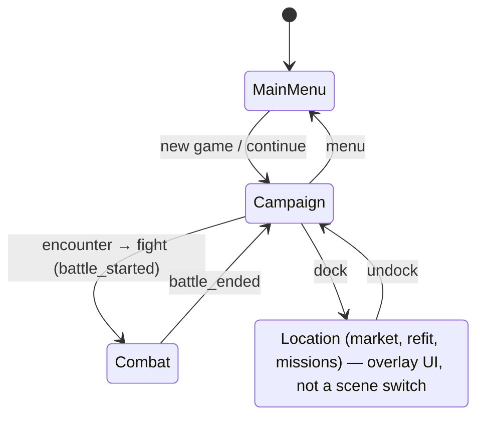
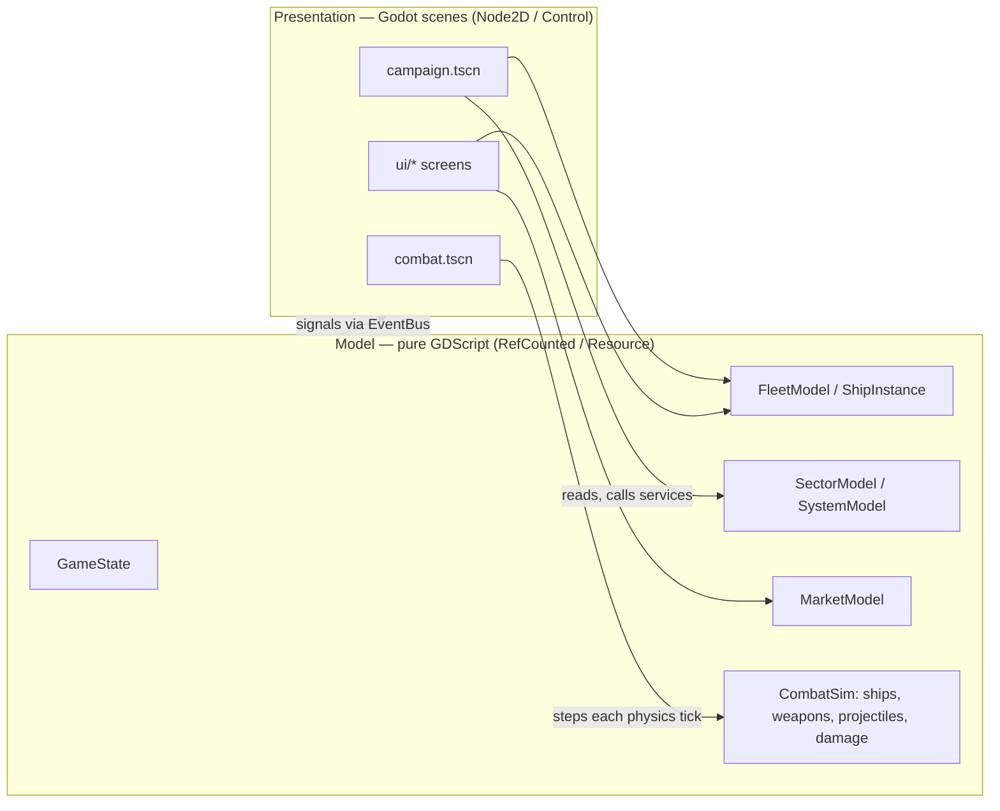
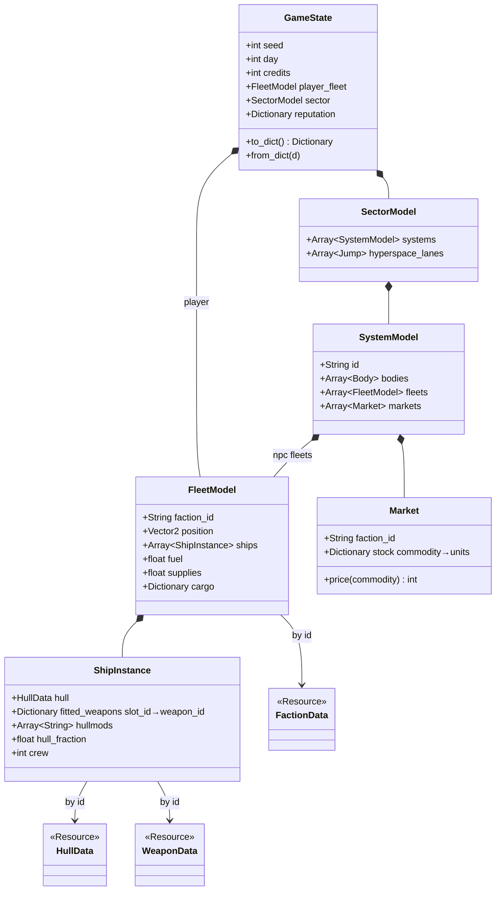
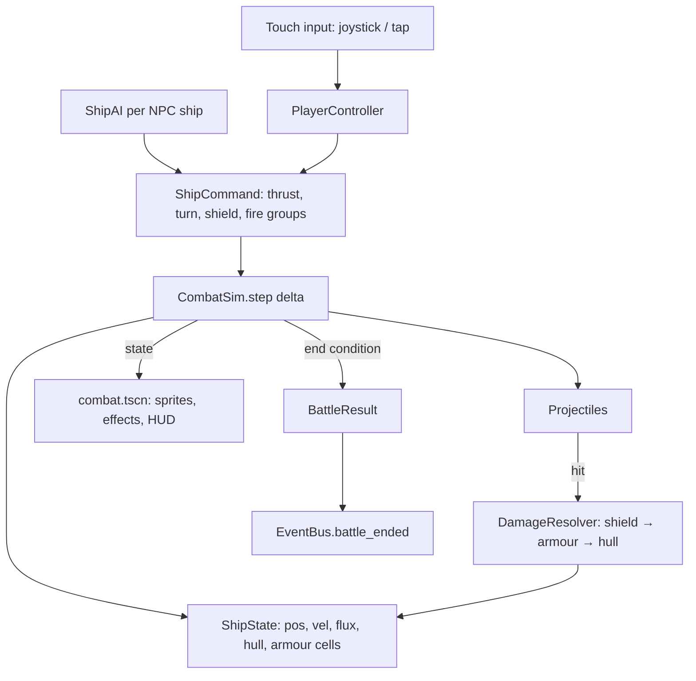

# Star Navigator — Architecture

This document describes how the game is built so that every milestone in
[ROADMAP.md](ROADMAP.md) adds to the same structure instead of bolting on a new one.
Requirements referenced as `FR-…`/`NFR-…` are in [REQUIREMENTS.md](REQUIREMENTS.md).

## 1. Technology decisions

| Decision | Choice | Why | Alternatives considered |
| --- | --- | --- | --- |
| Engine | **Godot 4.7+** | Free, open source, first-class 2D, native Android/iOS/Web export, small runtime, no licensing. | Web + PixiJS (closest to the author's previous projects, but weaker physics/particles and store packaging); Flutter + Flame; Unity (licensing, heavy). |
| Language | **GDScript**, statically typed (`var x: int`, `-> void`) | Fastest iteration inside the editor; typed code is checked by the parser and runs faster. | C# (better tooling, but slower Godot exports on mobile and a second toolchain). |
| Renderer | **GL Compatibility** (OpenGL ES 3.0 / WebGL 2) | Widest device coverage, required for Web export, sufficient for 2D. | Forward Mobile (Vulkan) — reconsider only if a 2D effect needs it. |
| Orientation | **Landscape**, sensor-rotated | Combat needs two thumbs and a wide arena. | Portrait would suit the map but cripples combat. |
| Base resolution | 1280×720, stretch `canvas_items`, aspect `expand` | UI designed at 720p scales crisply; `expand` uses the full width of 20:9 phones. | Fixed aspect with letterboxing. |
| Content format | Godot **Resources** (`.tres`) with typed `class_name` scripts | Editable in the inspector, typed, validated at load, diffable text. | JSON (no editor support, untyped). |
| Save format | **JSON** in `user://saves/`, versioned | Human-readable, survives script refactors (a `.tres` save breaks when a class changes), easy to migrate. | Binary `ResourceSaver` (fragile across versions). |
| Tests | **gdUnit4** | Runs headless in CI, supports scene and pure-logic tests. | GUT. |
| CI | GitHub Actions: `gdlint`, later gdUnit4 and Web/Android exports | Same host as the repository; Web export publishes a playtest build to GitHub Pages. | — |

## 2. Repository layout

```
star-navigator/
├── project.godot          Godot project (autoloads, display, renderer settings)
├── icon.svg
├── src/                   All code and scenes, one folder per domain
│   ├── core/              Autoload singletons: EventBus, Settings, DataRegistry,
│   │                      GameState, SaveService, SceneRouter
│   ├── data/              Resource class definitions (HullData, WeaponData, …)
│   ├── campaign/          Sector, star systems, fleets moving, encounters, time
│   ├── combat/            Battle scene, ship controllers, weapons, AI
│   ├── fleet/             ShipInstance, refit rules, repairs, salvage
│   ├── economy/           Markets, commodities, prices, missions
│   └── ui/                Screens and reusable controls, one folder per screen;
│       └── theme/         the single Theme resource, virtual joystick
├── data/                  Content: one .tres per hull / weapon / faction / …
├── assets/                sprites/, audio/, fonts/ (see assets/README.md)
├── tests/                 gdUnit4 tests for the model layer
├── docs/                  This document, REQUIREMENTS.md, ROADMAP.md
└── .github/workflows/     CI
```

Rules:

- **A domain folder never imports scenes from another domain.** Cross-domain
  communication goes through `EventBus` signals or through `GameState`.
- **`src/ui/` may read any domain's model; no domain may reach into `ui/`.**
- **Content lives in `data/`, never in scripts.** A hull is a `.tres`, not a `const`.
- **One scene per screen or entity**, named like its folder (`main_menu/main_menu.tscn`
  + `main_menu.gd`). Scripts are attached to the scene root only; child nodes hold no
  scripts unless they are reusable controls.

## 3. Runtime structure

### 3.1 Autoloads (the backbone)

Six singletons are registered in `project.godot` and exist for the whole run, in
this order (later ones may use earlier ones in `_ready()`):

| Autoload | Responsibility | Never does |
| --- | --- | --- |
| `EventBus` | Declares every cross-domain signal (`battle_ended`, `day_passed`, `back_requested`, …). | Hold state. |
| `Settings` | User preferences, persisted in `user://settings.cfg`. | Touch the save game. |
| `DataRegistry` | Loads every Resource under `data/` into tables keyed by `id`; `get_entry("hulls", "kestrel")`. | Mutate content. |
| `GameState` | The in-memory model of the current playthrough; `to_dict()`/`from_dict()`. | Render or know about scenes. |
| `SaveService` | Write/read `GameState` as versioned JSON, migrate old versions. | Decide *when* to save (callers do, per FR-SAV-1). |
| `SceneRouter` | Switch top-level scene by name (`go("campaign")`); route the Android back button and Escape to `EventBus.back_requested`. | Pass data between scenes (that is `GameState`'s job). |

### 3.2 Scene flow



Only `MainMenu`, `Campaign` and `Combat` are top-level scenes changed by
`SceneRouter`. Location menus, the refit screen, the sector map and pause menus are
`CanvasLayer` overlays instantiated inside `Campaign`, because they need the campaign
state to remain loaded and paused behind them.

### 3.3 Model vs presentation

Every domain is split in two layers:



- **Model classes** have no `Node` in them, take a `RandomNumberGenerator` when they
  need randomness, and are the unit-tested part of the game (NFR-6, NFR-9). The
  combat simulation is stepped with a fixed `delta` from `_physics_process`, so the
  same inputs give the same battle.
- **View scenes** own nodes, sprites, particles, cameras and input. They read the
  model every frame and forward input to it; they never hold game state that the
  model does not also hold. If a view is destroyed and recreated from the model, the
  game looks the same.
- **Save = serialise the model.** `GameState.to_dict()` recursively asks each owned
  model for its dictionary; views are not saved.

### 3.4 Domain model



Static content (`HullData`, `WeaponData`, `FactionData`) is referenced **by id**
from the dynamic model, so saves contain `"hull": "kestrel"`, not a copy of the hull
stats. Rebalancing a hull therefore applies to existing saves.

## 4. Combat architecture (M2–M3)



- `CombatSim` is a model class stepped at the physics rate (60 Hz). Ships are
  kinematic in the sim; the scene mirrors positions into `Node2D`s. Godot physics is
  used only for hit detection (`Area2D` on projectiles) in early milestones and can
  be replaced by sim-side circle tests if determinism demands it.
- **Damage pipeline** (FR-CBT-2/3): shield arc check → flux added (× shield
  efficiency, × damage-type modifier) → else armour cell hit (damage reduced by armour
  value, armour depleted) → remaining to hull. Weapon stats come from `WeaponData`,
  never from the scene.
- **AI** is a small behaviour tree per ship: choose target, keep preferred range,
  raise shield when threatened, vent flux when safe, obey the fleet order (engage /
  hold / retreat). Orders come from the command overlay (FR-CBT-5).
- **Touch controls** (FR-UX-2) are a reusable `VirtualJoystick` control and a
  `TapTarget` mode; both produce the same `ShipCommand`.

## 5. Campaign architecture

Shipped in M1 (single ship, placeholder system):

- `ShipMover` (pure model): arrive-at-target steering with acceleration, max speed
  and turn rate from `HullData`; `player_ship.gd` steps it in `_physics_process` and
  mirrors position/heading. `write_state()` copies them into `GameState.location`
  before every save.
- `campaign.gd` owns the touch grammar (tap = course, drag from ship = course, drag
  elsewhere = pan, two fingers = zoom) and hosts the HUD `CanvasLayer`
  (`process_mode = ALWAYS`) with the pause and settings overlays.
- `campaign_camera.gd`: follow with lerp, pan detaches, `recenter()` re-attaches;
  `screen_to_world` is computed from position and zoom rather than the canvas
  transform so it is valid in the same frame the zoom changes.
- `starfield.gd`: three parallax layers, each a seeded 1024² tile texture built at
  start-up and drawn tiled over the visible rect, shifted by `-camera.position × depth`.
- Back button: `SceneRouter` turns `NOTIFICATION_WM_GO_BACK_REQUEST` and `ui_cancel`
  into `EventBus.back_requested`; the active scene decides (close overlay → pause →
  on the title, quit on mobile). `application/config/quit_on_go_back` is off.

Planned for M4+:

- **Generation** (`SectorGenerator`, FR-CMP-1): seeded; places systems on a
  grid-with-jitter, assigns stars, planets, stations and faction ownership, and links
  systems into a connected hyperspace graph. Output is a `SectorModel`, testable
  without a scene.
- **Time** (FR-CMP-3): `CampaignClock` advances only while the player fleet moves or
  the player explicitly waits; emits `EventBus.day_passed`. Every daily system
  (supplies, market drift, NPC fleet spawning) subscribes to that signal.
- **NPC fleets** run a lightweight goal-based AI (`patrol`, `trade A→B`, `hunt`) in
  the model; only fleets in the current system are rendered.
- **Encounters** (FR-CMP-5): proximity between fleets emits `encounter_triggered`;
  the encounter dialog decides, and a fight builds a `BattleContext` (both fleets,
  terrain, objectives) and routes to `Combat`. `battle_ended` applies the result to
  the models and returns to `Campaign`.

## 6. Data pipeline

- Each content type has a `class_name` Resource script in `src/data/` and a folder
  under `data/`. `DataRegistry.ROOTS` maps table name → folder.
- Every entry has a unique `id` (snake_case, stable forever — it is what saves
  reference). File name = id.
- Balance-sensitive numbers live only in `.tres` files; code reads them, never
  duplicates them.
- Sprites referenced from a Resource live in `assets/sprites/<type>/<id>.png`.

## 7. Persistence

- **Where:** `user://saves/<slot>.json` (Android: app-private storage; nothing else
  is touched, NFR-7). `user://settings.cfg` is separate and not part of a save.
- **What:** `GameState.to_dict()` with a top-level `"version"`.
- **Versioning (FR-SAV-3):** bump `GameState.SAVE_VERSION` whenever the shape
  changes; add a `match` arm in `SaveService._migrate()` that upgrades *one*
  version. Old saves are migrated step by step, and a unit test keeps one fixture
  per historical version.
- **When (FR-SAV-1):** callers save at safe transitions — scene change, dock/undock,
  battle end — and on `NOTIFICATION_APPLICATION_PAUSED` / `_FOCUS_OUT`. Never
  mid-battle (a battle is resumed from its `BattleContext`, not from mid-state).
- **Failure (FR-SAV-4):** load errors return an `Error`; the title screen shows a
  message and keeps "New game" available.

## 8. Input and UI

- **Touch-first:** `emulate_touch_from_mouse` is on so the desktop editor behaves
  like a phone. No `hover` states carry information.
- **Safe area:** the HUD root is a `MarginContainer` whose margins are set from
  `DisplayServer.get_display_safe_area()` at startup and on rotation.
- **Theme:** one `Theme` resource in `src/ui/theme/` with 48 dp minimum button
  sizes and 14 dp minimum font; `Settings.ui_scale` scales the root `Control`.
- **Back:** the Android back button is handled centrally: overlays close, then the
  pause menu opens; the game never exits silently.

## 9. Testing and CI

| Layer | Tool | When |
| --- | --- | --- |
| Static | `gdlint` (gdtoolkit) on `src/` and `tests/` | Every push |
| Smoke | `tests/smoke.gd`, a `SceneTree` script run headless in the `barichello/godot-ci` container: model checks, every scene instantiates, a simulated tap moves the ship, save round-trip | Every push |
| Unit | gdUnit4 on `tests/**` — model classes only | From M2 |
| Export | Godot headless export in CI: Web → GitHub Pages (https://carlot78.github.io/star-navigator/), Android debug APK as a workflow artifact (experimental) | Every push to `main` |
| Manual | Milestone checklist on the reference phone (NFR-1/2/5) | End of every milestone |

## 10. Conventions

- GDScript style guide: tabs, `snake_case` members, `PascalCase` classes, `_private`
  members, `## ` doc comments on every class and public method.
- Static typing everywhere (`var n: int`, `func f() -> void`); `Variant` only at JSON
  boundaries.
- Signals are past-tense events; the emitter never assumes who listens.
- Scenes: root node named like the file in PascalCase; `@onready` node references at
  the top of the script; connect signals in `_ready()` in code, not in the `.tscn`,
  so the wiring is greppable.
- Commit messages: imperative, one concern; PRs reference the `FR-`/`NFR-` ids they
  deliver.

## 11. Risks and mitigations

| Risk | Mitigation |
| --- | --- |
| Combat on touch feels bad (the make-or-break of the whole idea) | M2 is a 1-vs-1 vertical slice on the real phone before any campaign work; two control schemes from the start. |
| Performance with many ships and projectiles on low-end GPUs | Sim in model code (cheap), sprites via `MultiMesh` for projectiles if needed, benchmark scene from M3, GL Compatibility from day one. |
| Save-format churn during early milestones | Version + migrations from M0; only *released* versions must migrate — pre-release saves may be dropped with a bump. |
| Scope explosion (the inspiration is a decade of work) | Milestones are strictly ordered; each ends in a build; features in REQUIREMENTS with priority C wait until every M is done. |
| IP proximity to Starsector | §7 of REQUIREMENTS: original names, art, text; mechanics only. |
